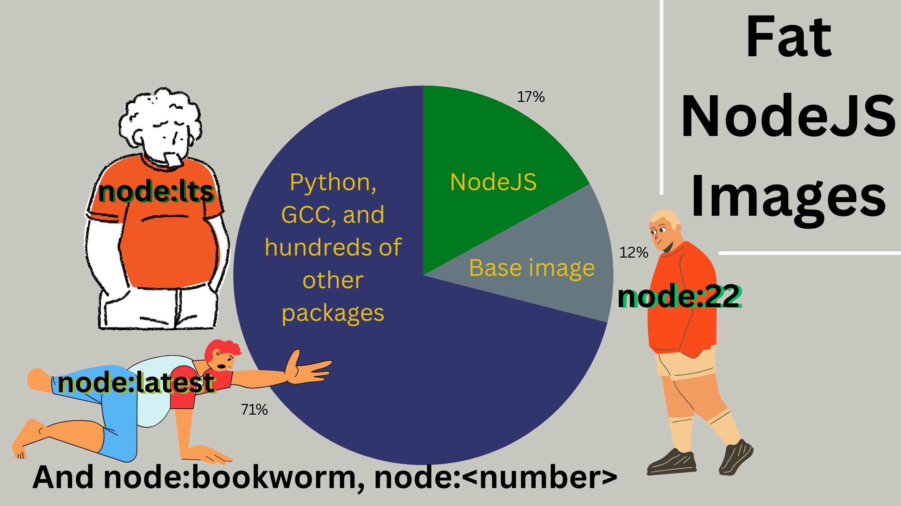

# Choose the right image

A worthy contender, bitnami. Similar to official images most of the times but there are cases that bitnami shines too, like MongoDB.

## NodeJS

[Help! My Node.js Docker Image Has Python 🐍 — Uncovering the Right Base Image for Your Node.js App](https://newsletter.iximiuz.com/posts/help-my-node-js-docker-image-has-python-uncovering-the-right-base-image-for-your-node-js-app).

> [!CAUTION]
>
> If you do not need to compile a NodeJS module from CPP it is best to use `node:22-slim` or any other slim versions!
>
> 
>
> This increases:
>
> - Security, no shell, no other 3rd-party lib/pkg that you do not need.
> - Cost efficiency, do not need too much space, less conflicting or issues with libs, less maintenance time on things that you ain't even using.

## PostgreSQL

- Same as NodeJS image we ain't gonna use bullseye, bookworm, or the ones taged with a number since they are all fat images.
- In this case we use `*-alpine*` images.
