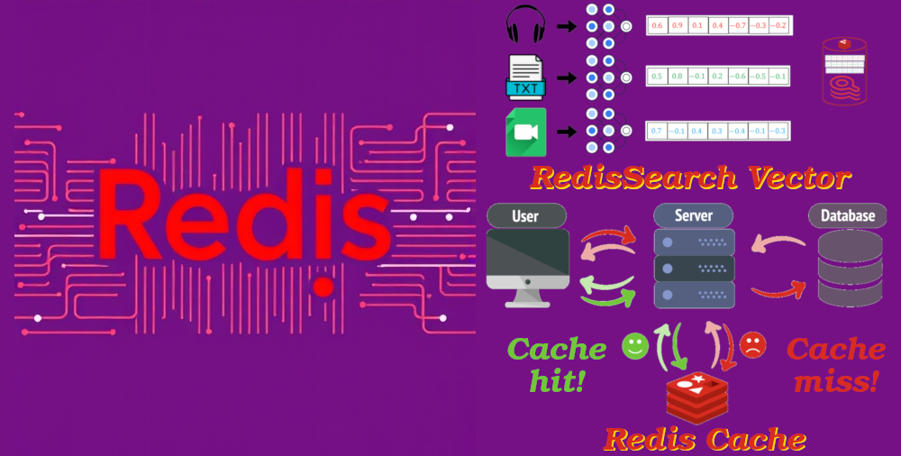
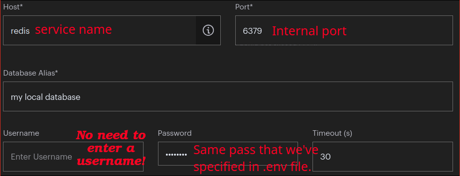

# Redis

- Fastest data platform.
- Open source, advanced key-value store.
- Provides cloud and on-premise solutions for:

  - Caching.
  - Vector search.
  - NoSQL databases.

  

- Seamlessly fit into any tech stack.
- "Protected mode" is turned off by default.
  - For ease of use in dev env.
  - If you expose the port outside of your host, it will be open without a password to anyone.
  - Supplying a config file, in that file set a password.
  - Learn more:
    - [Redis documentation on security⁠](https://redis.io/docs/latest/operate/oss_and_stack/management/security/).
    - [Protected mode⁠](https://redis.io/docs/latest/operate/oss_and_stack/management/security/#protected-mode).
    - [A few things about Redis security by antirez⁠](http://antirez.com/news/96).
- We use [Redis Insight](https://hub.docker.com/r/redis/redisinsight) as our dashboard.
- I use bitnami since it is well documented.

  - It uses [_AOF persistence_](./glossary.md#aofStandsForGlossary).
  - **NOTE**: The `@` is not supported for `REDIS_PASSWORD`.
  - Note that Redis's default port number is 6379, but we can change it:

    ```shell
    docker run --name redis -e REDIS_PORT_NUMBER=7000 -p 7000:7000 bitnami/redis:latest
    ```

- In the `healthcheck` command for the Redis we are passing the password and the port that your Redis instance is using within the container:
  1. To learn more about why our healthcheck command is using `grep PONG` read [this Stackoverflow Q&A](https://stackoverflow.com/a/71504657/8784518).
  2. We need to prevent docker compose from parsing environment variables inside our test command, thus the reason we used `$$` ([ref](https://stackoverflow.com/a/54989793/8784518)).

## Redis Insight

- An ideal tool for developers who build with any Redis deployments to optimize their development process.
- Let you visually browse and interact with data, take advantage of the advanced command line interface and diagnostic tools.
- Log levels: `error`, `warn`, `info`, `http`, `verbose`, `debug`, `silly`.

### How to connect to the local Redis instance?


