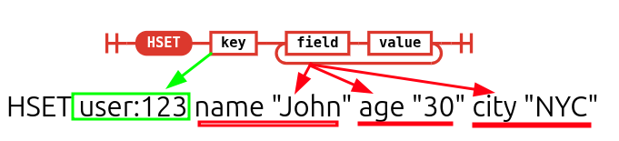

# Redis Commands

These are the commands we are using

- `HSET`: stores multiple pieces of information under one key, like a mini dictionary. Think of it like a contact card.
  - The key is the person's name.
  - The fields are labels like "age" or "city".
  - The values are the actual age or city name.

  

  Redis offers different data structures, `SET` and `HSET` commands belong to two different ones:
  - `SET` works with simple string values.
  - `HSET` works with hashes (think: mini‑key/value maps stored under one top-level key).

- `HGET`: retrieves the value of a **specific field** from a hash stored at a given key in Redis.
  ```cmd
  > HSET myhash field1 "foo"
  (integer) 1
  > HGET myhash field1
  "foo"
  > HGET myhash field2
  (nil)
  ```
- `ZADD`: Add/update members in a sorted set with a score.

  ```cmd
  > ZADD scores 90 "Alice" 85 "Bob" 95 "Charlie"
  (integer) 3
  ```

  - This creates a sorted set scores with:
    - `Alice` with score 90.
    - `Bob` with score 85.
    - `Charlie` with score 95.
  - The set is sorted by score in **ascending order**:
    ```cmd
    Bob (85), Alice (90), Charlie (95).
    ```

  ```cmd
  > ZADD scores 192 "Alice"
  (integer) 0
  ```

  - Updates `Alice`'s score to 192. Meaning alice will take `Charlie`'s position.

- `ZRANGE`: retrieves a specified range of elements from a sorted set.
  - It supports three types of range queries:
    - By index (rank):
      - Use 0-based indexes to get elements by position.
      - Negative numbers count from the end.

      ```cmd
      > ZRANGE scores 0 -1 WITHSCORES
      1) "Bob"
      2) "85"
      3) "Charlie"
      4) "95"
      5) "Alice"
      6) "192"
      ```

    - **By score**:
      - Use `BYSCORE` to get elements within a score range.
      - You can use `-inf` and `+inf` for infinity, and (`start`, `stop`) for exclusive ranges.
      - **The one used in our `OutboxService`**.
    - By lexicographical order:
      - Use `BYLEX` to get elements within a string range.
      - Use `[` for inclusive and `(` for exclusive ranges.

  - Additional options:
    - `REV`: Reverses the order (highest to lowest score).
    - `LIMIT`: Limits the number of results returned.
    - `WITHSCORES`: Returns both values and their scores.

- `ZREM`: Removes the specified members from the sorted set stored at key. Non existing members are ignored.
  ```cmd
  > ZREM scores "Alice"
  (integer) 1
  > ZRANGE scores 0 -1 WITHSCORES
  1) "Bob"
  2) "85"
  3) "Charlie"
  4) "95"
  ```
- `SET`: sets a key to a string value (used here with `NX` and `PX` for **locks**).
  - `NX` option: set only if not exists.
  - `PX` option: sets the TTL for a key in milliseconds.
    ```cmd
    > SET key value PX 5000
    ```
- `DEL`: removes the specified keys. A key is ignored if it does not exist.

  ```cmd
  > SET key1 "val1"
  "OK"
  > SET key2 "val2"
  "OK"
  > DEL key1 key2 key3
  (integer) 2
  ```

  This command's behavior varies in clustered Redis environments. [In ioredis we have to delete them individually if they are in different slots](https://github.com/kasir-barati/docker/blob/6bce6992855eca76e2be21bd9821f0e87d5705e4/docker-compose-files/redis/cluster/src/index.ts#L77-L83).
